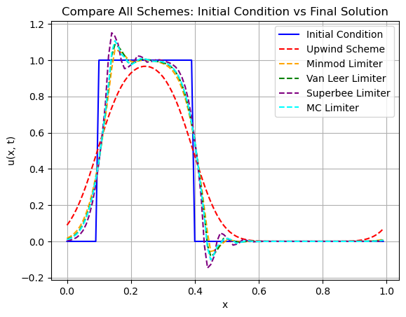
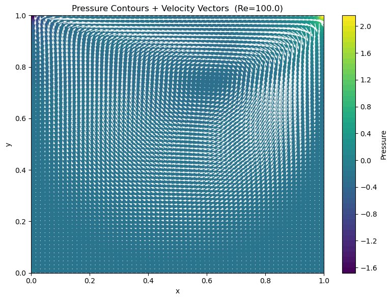
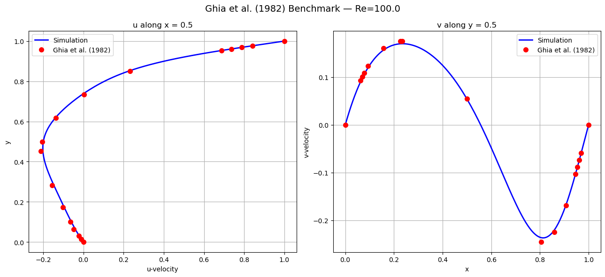
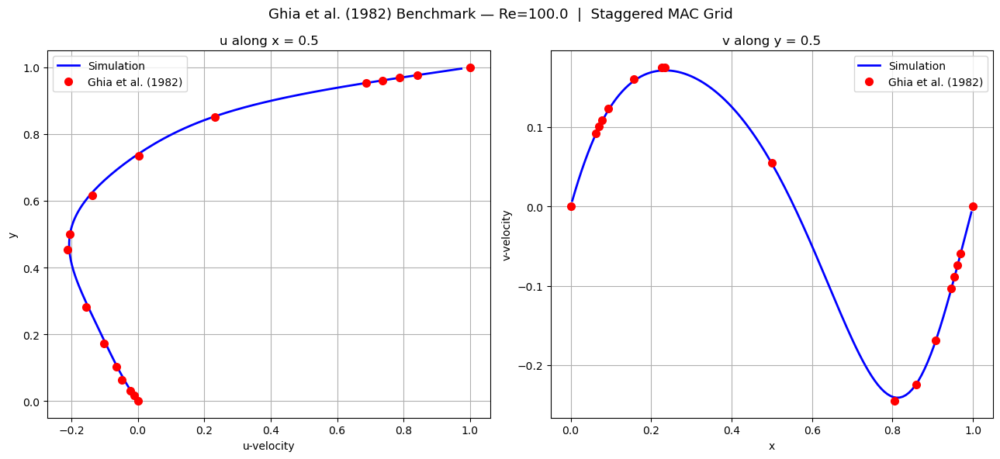
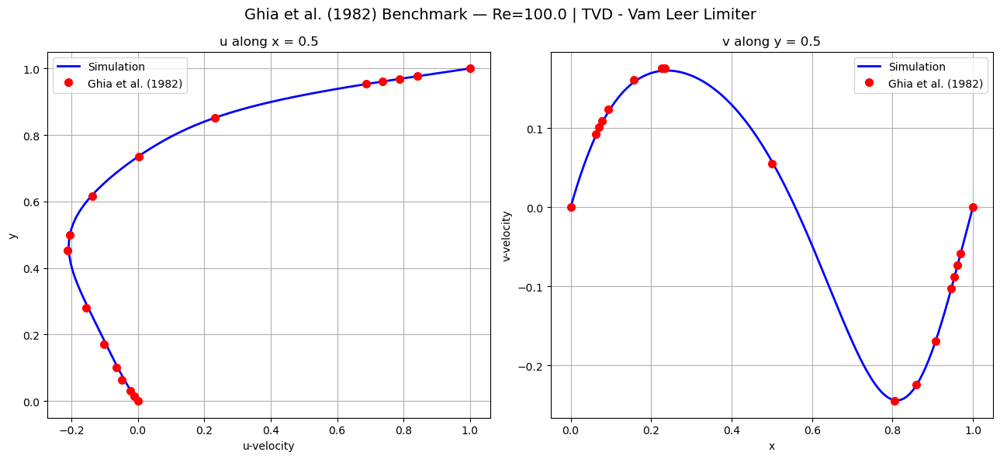
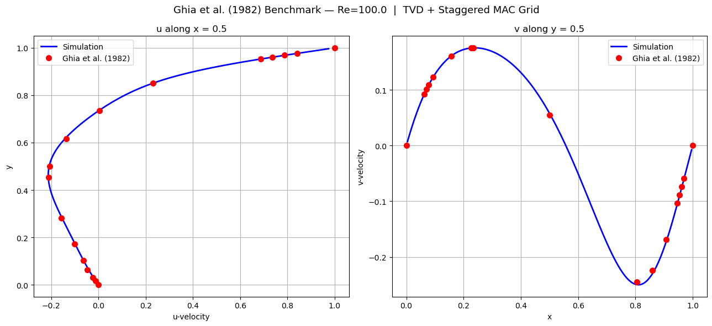

# Effects of Grid Arrangement and Convection-Scheme Discretisation on Projection-Method Accuracy for the Lid-Driven Cavity: A Verification Study

**Author:** Harish Ragul Rajaramaduraikarthik (ORCID: 0009-0007-5058-3995)
**Affiliation:** Indian Institute of Information Technology, Design and Manufacturing, Kancheepuram
**Corresponding author email:** harishragulkarthik@gmail.com

**Keywords:** lid-driven cavity; verification and validation; projection method; staggered grid; collocated grid; TVD flux limiters; Ghia benchmark

---

## Abstract

Published verification studies of the lid-driven cavity rarely isolate how much of a solver's accuracy comes from grid arrangement versus convection-term discretisation, since most report only a single configuration. This study reports a systematic 2×2 verification comparison — collocated versus staggered (MAC) grid arrangement, crossed with first-order upwind versus second-order TVD (Van Leer) convection discretisation — for a projection-method solver at Re = 100, all four variants validated against Ghia et al. (1982) using an identical quantitative error metric (cubic interpolation onto the benchmark's sample points, maximum absolute deviation). All four variants agree with the benchmark to within approximately 1% in both velocity components, with TVD improving on upwind in at least one component, consistent with reduced numerical diffusion. A companion 1D screening study compares five convection schemes (upwind and four TVD limiters — minmod, Van Leer, superbee, MC) on a linear advection test using both an L2 accuracy metric and overshoot/undershoot as a monotonicity metric, giving an a priori, quantitative basis for selecting Van Leer over the more diffusive minmod or the less monotonic superbee and MC. A collocated-grid TVD configuration previously reported by the author to exhibit pressure-solver convergence difficulty is re-examined and found to converge cleanly, achieving the lowest v-velocity error of all four configurations tested — a result discussed alongside the checkerboard-pressure-mode literature for collocated grids (Rhie & Chow, 1983).

---

## 1. Introduction

The lid-driven cavity flow — a unit square cavity with three stationary walls and one wall translating at constant velocity, driving a primary recirculating vortex — has served as a canonical verification test for incompressible viscous flow solvers since Ghia, Ghia and Shin (1982) published tabulated centreline velocity profiles obtained with a multigrid vorticity-streamfunction method. Its appeal as a benchmark is that the geometry is trivial while the flow itself is not: the solution contains a primary vortex, secondary corner vortices, sharp boundary-layer gradients near the moving wall, and — because the lid velocity is discontinuous at the top two corners — a genuine singularity that stresses a solver's boundary treatment. Botella and Peyret (1998) later provided a very high accuracy spectral solution for the same problem, and Erturk (2009) surveyed and reconciled discrepancies among many independently published cavity solutions, underscoring that even for this well-worn benchmark, quantitative agreement between independent solvers is sensitive to discretisation choices that are not always reported or controlled for.

That sensitivity is the specific gap this study addresses. Two discretisation choices are routinely made when building a projection-method solver for this problem — whether velocity and pressure are stored on a collocated or a staggered (Marker-and-Cell, Harlow & Welch, 1965) grid, and whether the convection term is discretised with simple first-order upwind differencing or a higher-resolution TVD scheme — but published verification studies typically report only one combination, making it difficult for a reader to know how much of the reported accuracy is attributable to the grid arrangement versus the convection scheme. This study reports a controlled 2×2 comparison of both factors on identical grid resolution, Reynolds number, and error metric, so the two effects can be compared directly rather than inferred across different papers with different setups.

This work extends an earlier verification note by the author (Rajaramaduraikarthik, 2026), which reported a single collocated-grid, upwind-convection projection-method solver validated against Ghia et al. (1982), and which identified two open items: a small discrepancy in the v-velocity trough attributed to upwind numerical diffusion, and an unresolved difficulty in combining a TVD convection scheme with the collocated-grid pressure solve, tentatively attributed to interaction with the checkerboard pressure modes documented by Rhie and Chow (1983) for collocated arrangements. The present study makes two contributions toward closing those items:

1. A controlled four-way verification comparison — collocated/staggered grid arrangement crossed with upwind/TVD convection — quantified with an identical error metric against Ghia et al. (1982), directly re-examining the previously reported collocated-TVD convergence difficulty under the current implementation.
2. An a priori, quantitative flux-limiter selection methodology: rather than selecting a TVD limiter by convention, five schemes (upwind and four limiters) are first screened on a 1D linear advection test using both an accuracy metric (L2 error) and a monotonicity metric (overshoot/undershoot), and the limiter used in the 2D study is selected based on that comparison.

## 2. Problem Description and Governing Equations

The domain is a unit square cavity (length $L$ = height $H$ = 1) containing an incompressible, viscous, Newtonian fluid, governed by the non-dimensional incompressible Navier-Stokes equations:

$$\nabla \cdot \mathbf{u} = 0 \tag{1}$$

$$\frac{\partial \mathbf{u}}{\partial t} + (\mathbf{u} \cdot \nabla)\mathbf{u} = -\nabla p + \frac{1}{\mathrm{Re}}\nabla^2 \mathbf{u} \tag{2}$$

Three walls are stationary (no-slip, $\mathbf{u} = 0$); the top wall translates at constant velocity $U_{\mathrm{lid}} = 1$ in the $x$-direction ($u = U_{\mathrm{lid}}, v = 0$). The Reynolds number is $\mathrm{Re} = U_{\mathrm{lid}} L / \nu = 100$ throughout this study, matching Ghia et al. (1982). The moving lid drags the adjacent fluid, which — with no outlet — recirculates into a primary vortex; this combination of a simple domain with a genuinely nontrivial, singularity-containing solution is what makes the problem an effective and widely used solver benchmark.

## 3. Numerical Methods

### 3.1 Projection (fractional-step) method

All four solver variants use the same projection method (Chorin, 1968) to decouple the velocity and pressure updates. A momentum predictor step advances the velocity field ignoring the pressure gradient, producing an intermediate field $\mathbf{u}^{*}$ that is not, in general, divergence-free:

$$\mathbf{u}^{*} = \mathbf{u}^{n} + \Delta t\left[-(\mathbf{u}^n \cdot \nabla)\mathbf{u}^n + \frac{1}{\mathrm{Re}}\nabla^2 \mathbf{u}^n\right] \tag{3}$$

A pressure-correction (Poisson) equation is then solved for $p'$ so that subtracting its gradient from $\mathbf{u}^{*}$ restores incompressibility:

$$\nabla^2 p' = \frac{\rho}{\Delta t}\left(\nabla \cdot \mathbf{u}^{*}\right) \tag{4}$$

$$\mathbf{u}^{n+1} = \mathbf{u}^{*} - \frac{\Delta t}{\rho}\nabla p' \tag{5}$$

Time integration is explicit forward Euler; the time step is set from the combined convective/diffusive stability limit $\Delta t = \sigma / (U/\Delta x + U/\Delta y + 4\nu/\Delta x^2)$, with safety factor $\sigma = 0.8$ for the upwind variants and $\sigma = 0.4$ for the TVD variants (TVD schemes require CFL $\leq 0.5$ per direction for the limiter to remain stable). What differs between the four solver variants examined here is (i) where $\mathbf{u}$ and $p$ are stored on the grid, and (ii) how the nonlinear convective term $(\mathbf{u} \cdot \nabla)\mathbf{u}$ in Eq. (3) is discretised.

### 3.2 Grid arrangement: collocated vs. staggered

The **collocated** variants store $u$, $v$, and $p$ at the same 129×129 cell-centre locations. This is simple to implement but is known to permit spurious checkerboard pressure oscillations, because the discrete pressure gradient evaluated at a node does not depend on the pressure value at that same node — a decoupling first analysed by Rhie and Chow (1983) in the context of collocated finite-volume solvers.

The **staggered** (Marker-and-Cell) variants instead store $p$ at 129×129 cell centres, $u$ on the vertical cell faces, and $v$ on the horizontal cell faces, following Harlow and Welch (1965). This staggering removes the checkerboard mode by construction, at the cost of requiring interpolation whenever a variable is needed at a location where it is not natively stored (e.g. reconstructing cell-centred velocities for the centreline comparison against Ghia et al., described in Section 6).

### 3.3 Convection discretisation: upwind vs. TVD

The **upwind** variants discretise $(\mathbf{u} \cdot \nabla)\mathbf{u}$ with first-order upwind differencing, which is unconditionally stable in the sense of introducing no non-physical oscillations, but numerically diffusive — it smears steep gradients such as those near the moving lid.

The **TVD** variants replace this with a Sweby-form (Sweby, 1984) high-resolution flux-limiter scheme using the Van Leer limiter (van Leer, 1974):

$$\phi_{\mathrm{VL}}(r) = \frac{r + |r|}{1+|r|} \tag{6}$$

where $r$ is the ratio of consecutive solution gradients. This limiter blends toward an unlimited second-order-accurate scheme in smooth regions of the flow ($\phi \to 1$ as the flow becomes locally linear) while reverting toward first-order upwind ($\phi \to 0$) near steep gradients, avoiding the spurious oscillations an unlimited second-order scheme would introduce at those locations. Section 4 reports why Van Leer specifically was selected over the three other TVD limiters considered.

### 3.4 Pressure solve

The two collocated variants solve the discrete form of Eq. (4) by Jacobi iteration (maximum 20,000 iterations per time step, convergence tolerance $10^{-6}$ in the max-norm, homogeneous Neumann conditions on all four walls, pressure pinned to zero at one interior node to remove the additive constant). The two staggered variants instead assemble the discrete Poisson operator as a sparse matrix once at the start of the run and LU-factorise it up front (`scipy.sparse.linalg.factorized`), so that each time step's pressure solve is a single fast back-substitution rather than an iterative loop.

## 4. Choice of Flux Limiter: A 1D Screening Study

Rather than reusing the Van Leer limiter by convention, five convection schemes — first-order upwind and four TVD limiters (minmod, Van Leer, superbee, and MC) in the Sweby (1984) flux-limiter framework — were first compared on a 1D linear advection test, so that the limiter carried forward into the 2D study (Section 3.3) is selected on the basis of measured behaviour. The test advects a square pulse at constant velocity $c=1$ on a periodic unit-length domain ($N=100$, CFL $=0.5$) for exactly one full domain transit (200 time steps); because the domain is periodic and the transit distance equals exactly one domain length, the exact solution at the final time is identical to the initial condition, giving a closed-form reference for the L2 error without requiring a separate analytical solution for the advected profile.

**Table 1.** 1D advection screening: L2 error and monotonicity after one full periodic transit.

| Scheme | L2 error | Overshoot (max − 1) | Undershoot (min) |
|---|---|---|---|
| Upwind | 0.1817 | −0.0341 (none) | 0.0000 (none) |
| Minmod | 0.1365 | 0.0574 | −0.0556 |
| Van Leer | 0.1317 | 0.0863 | −0.0817 |
| MC | 0.1303 | 0.1073 | −0.1017 |
| Superbee | 0.1251 | 0.1507 | −0.1466 |

The results reproduce the well-documented accuracy/monotonicity trade-off among these limiters. Upwind has by far the largest L2 error — approximately 38% higher than any TVD scheme — a direct consequence of numerical diffusion smearing the pulse's sharp edges, but is perfectly monotonic (zero overshoot and undershoot) by construction. Superbee sits at the opposite extreme: the lowest L2 error of the five, but also by far the largest overshoot and undershoot, more than double Van Leer's. This is consistent with superbee's known position at the most compressive edge of the Sweby TVD diagram, where it can sharpen gradients into new local extrema while remaining formally TVD.

Van Leer is not optimal on either single axis in isolation — MC and superbee both achieve lower L2 error, and minmod achieves better monotonicity — but it surrenders comparatively little on either: approximately 28% lower L2 error than upwind, while keeping overshoot/undershoot markedly smaller than MC or superbee. Given that the 2D collocated-TVD configuration examined in Section 6 was previously reported to have a pressure-solver sensitivity (Rajaramaduraikarthik, 2026; re-examined in Section 7), the additional sharpness superbee or MC would provide in 1D was judged not worth the additional oscillation risk it could introduce into the 2D pressure-velocity coupling. Van Leer was therefore selected for both TVD variants reported in Section 6.

**Figure 1.** All five schemes vs. the initial square pulse, after one full periodic transit (200 steps, CFL = 0.5). Upwind visibly smears the pulse; the TVD schemes stay much closer to the original shape, with superbee sharpest and most prone to overshoot at the corners.

## 5. Computational Setup

All four 2D solver variants use the domain and governing equations of Section 2 at Re = 100, on a 129×129 grid — either 129×129 collocated nodes, or 129×129 pressure cells with 129×130 and 130×129 velocity faces for the staggered arrangement — with explicit time integration as described in Section 3.1. Each run is advanced until the max-norm change in velocity between successive time steps falls below $10^{-6}$, taken as the steady-state convergence criterion.

## 6. Results

Figure 2 shows the steady-state pressure field and velocity vectors for the collocated, upwind-convection configuration, reproducing the qualitative flow structure reported previously (Rajaramaduraikarthik, 2026) as a reference point before the four configurations are compared quantitatively.

**Figure 2.** Pressure contours and velocity vectors at steady state (collocated grid, upwind convection). The primary vortex sits slightly right of centre, with pressure highest where the lid drives fluid into the right wall and lowest where the flow separates from the lid at the top-left corner.

Table 2 reports the maximum absolute error between each configuration's centreline velocity profiles and the Ghia et al. (1982) tabulated values, using an identical methodology for all four: the simulated $u(x=0.5, y)$ and $v(x, y=0.5)$ profiles are cubic-interpolated onto the exact Ghia sample points, and the largest absolute deviation is taken. This point-wise interpolated metric is a stricter, quantitative counterpart to the purely visual comparison reported previously (Rajaramaduraikarthik, 2026).

**Table 2.** Maximum error against Ghia et al. (1982) tabulated centreline data, Re = 100.

| Configuration | Grid | Convection | max$\lvert u - u_{\mathrm{Ghia}}\rvert$ | max$\lvert v - v_{\mathrm{Ghia}}\rvert$ |
|---|---|---|---|---|
| C1 (Rajaramaduraikarthik, 2026) | Collocated | Upwind | 0.0103 | 0.0091 |
| C2 | Staggered MAC | Upwind | 0.0107 | 0.0046 |
| C3 | Collocated | TVD (Van Leer) | 0.0081 | 0.0034 |
| C4 | Staggered MAC | TVD (Van Leer) | 0.0070 | 0.0057 |

All four configurations agree with Ghia et al. (1982) to within approximately 1% of the lid velocity in both components. Every TVD configuration improves on its upwind counterpart in at least one velocity component, consistent with the reduced numerical diffusion measured directly in Section 4. The lowest $u$-error is obtained by C4 (staggered + TVD, 0.0070); the lowest $v$-error by C3 (collocated + TVD, 0.0034). No single configuration dominates both error components simultaneously, and the spread across all four (0.0070–0.0107 for $u$; 0.0034–0.0091 for $v$) indicates the grid-arrangement and convection-scheme effects examined here are of comparable, modest magnitude relative to each other at this Reynolds number and resolution — i.e. within this 2×2 design, neither factor dominates the other. Figures 3–6 show the centreline profile comparisons underlying each row of Table 2.

**Figure 3.** Configuration C1 — collocated grid, upwind convection.

**Figure 4.** Configuration C2 — staggered MAC grid, upwind convection.

**Figure 5.** Configuration C3 — collocated grid, TVD (Van Leer) convection.

**Figure 6.** Configuration C4 — staggered MAC grid, TVD (Van Leer) convection.

## 7. Discussion

**Re-examination of the collocated-TVD configuration (C3).** Rajaramaduraikarthik (2026) reported that combining TVD convection with the collocated-grid pressure solve caused the pressure Poisson iteration to misbehave, and attributed this tentatively to interaction between the flux limiter and the checkerboard pressure modes documented for collocated grids by Rhie and Chow (1983). Re-examined under the present implementation, configuration C3 converges cleanly — the velocity residual decays monotonically from $O(10^{-1})$ to below the $10^{-6}$ convergence tolerance with no stalling — and achieves the lowest $v$-error of all four configurations tested (Table 2, Figure 5).

This does not, by itself, establish that the checkerboard mechanism proposed previously was absent; it establishes that whatever pressure-field behaviour may or may not be present, it does not measurably corrupt the centreline velocity comparison used as the validation metric in this and the prior study. Two explanations are consistent with the present result and are not mutually exclusive: (i) a regularisation term already present in the TVD slope-ratio calculation (a small constant, $10^{-6}$, added to the ratio's denominator specifically to prevent the limiter from responding to floating-point-level gradient noise once the flow approaches steady state) may be sufficient to suppress the previously observed misbehaviour; or (ii) checkerboard pressure oscillations may be present in the raw pressure field without propagating into the centreline velocity profile at a magnitude this error metric would detect. Distinguishing between these would require a direct spectral or spatial-frequency analysis of the pressure field, which was not performed in this study and is identified as a direction for future work.

**Grid arrangement vs. convection scheme as sources of error.** Table 2 shows that, at Re = 100 and the resolution tested, the accuracy differences attributable to switching grid arrangement (upwind: C1 vs. C2; TVD: C3 vs. C4) are of comparable magnitude to those attributable to switching convection scheme (collocated: C1 vs. C3; staggered: C2 vs. C4) — no single design axis dominates the other within this 2×2 comparison. This suggests that, for practitioners building a solver for problems of this class and resolution, the choice between collocated and staggered grids is better motivated by implementation complexity and the specific numerical robustness requirements of the target problem (e.g. susceptibility to checkerboard modes at the flow conditions of interest) than by an expectation of a systematically large accuracy penalty from the collocated arrangement alone.

## 8. Conclusion

This study reports a controlled four-way verification comparison of grid arrangement (collocated vs. staggered MAC) and convection-term discretisation (upwind vs. TVD/Van Leer) for a projection-method solver of the Re = 100 lid-driven cavity, together with an a priori 1D screening study used to select the TVD limiter on quantitative grounds rather than by convention. All four configurations agree with the Ghia et al. (1982) benchmark to within approximately 1%, and the previously reported collocated-TVD convergence difficulty (Rajaramaduraikarthik, 2026) is not reproduced under the present implementation — that configuration instead converges cleanly and achieves the lowest error in the v-velocity component of the four configurations tested, though whether the underlying checkerboard-mode mechanism proposed previously is genuinely absent, or simply not detectable in this study's centreline-based error metric, remains an open question identified for future work. Within the 2×2 design tested, grid arrangement and convection-scheme choice produce error differences of comparable magnitude, indicating neither factor alone dominates solver accuracy at this Reynolds number and resolution.

## Data Availability Statement

The solver source code (Jupyter notebooks for all four configurations and the 1D screening study), the figures reproduced in this manuscript, and the full numerical output underlying Tables 1 and 2 are available at the author's public repository, https://github.com/harishragul/cfd-research, under the same terms as the author's prior note (Rajaramaduraikarthik, 2026).

## Declaration of Competing Interest

The author declares no competing financial or personal interests that could have influenced the work reported in this manuscript.

## Declaration of AI-Assisted Technologies

The author used Claude Code (Anthropic), an AI coding assistant, in two capacities: assisting with debugging of the solver code, and grammar and language polishing of this manuscript's draft text. No generative AI was used to create, alter, or fabricate research data, results, or figures; all reported values were computed directly by the solver code and are reproducible from the repository referenced in the Data Availability Statement. The author reviewed all AI-assisted output and takes full responsibility for the code, results, and manuscript content. Further detail is provided in the accompanying `AI_USAGE_DISCLOSURE.md`.

## References

Botella, O., & Peyret, R. (1998). Benchmark spectral results on the lid-driven cavity flow. *Computers & Fluids, 27*(4), 421–433. https://doi.org/10.1016/S0045-7930(98)00002-4

Chorin, A. J. (1968). Numerical solution of the Navier-Stokes equations. *Mathematics of Computation, 22*(104), 745–762. https://doi.org/10.1090/S0025-5718-1968-0242392-2

Erturk, E. (2009). Discussions on driven cavity flow. *International Journal for Numerical Methods in Fluids, 60*(3), 275–294. https://doi.org/10.1002/fld.1887

Ghia, U., Ghia, K. N., & Shin, C. T. (1982). High-Re solutions for incompressible flow using the Navier-Stokes equations and a multigrid method. *Journal of Computational Physics, 48*(3), 387–411. https://doi.org/10.1016/0021-9991(82)90058-4

Harlow, F. H., & Welch, J. E. (1965). Numerical calculation of time-dependent viscous incompressible flow of fluid with free surface. *Physics of Fluids, 8*(12), 2182–2189. https://doi.org/10.1063/1.1761178

Rajaramaduraikarthik, H. R. (2026). *Lid-driven cavity flow: A Python projection method solver validated against Ghia et al. (1982)* [Technical note]. Zenodo. https://doi.org/10.5281/zenodo.20623227

Rhie, C. M., & Chow, W. L. (1983). Numerical study of the turbulent flow past an airfoil with trailing edge separation. *AIAA Journal, 21*(11), 1525–1532. https://doi.org/10.2514/3.8284

Sweby, P. K. (1984). High resolution schemes using flux limiters for hyperbolic conservation laws. *SIAM Journal on Numerical Analysis, 21*(5), 995–1011. https://doi.org/10.1137/0721062

van Leer, B. (1974). Towards the ultimate conservative difference scheme II. Monotonicity and conservation combined in a second-order scheme. *Journal of Computational Physics, 14*(4), 361–370. https://doi.org/10.1016/0021-9991(74)90019-9
